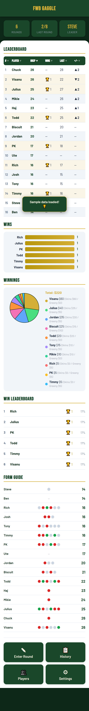

# FWB Gaggle — Stableford Handicap Tracker

A mobile-first, offline-capable web app for tracking weekly Stableford golf rounds, custom rolling handicaps, wins, skins, and greeny winnings for the FWB Gaggle group (~16 players).

**No install required.** Open `index.html` directly in any browser — phone or desktop.

---

## Getting Started

1. Open `index.html` in your browser (Chrome or Safari recommended on phone)
2. Default players are pre-loaded on first launch
3. Go to **Settings → Load Sample Data** if you want to see the charts with demo rounds before entering real data

---

## Dashboard

The home screen scrolls through all sections:

| Section | What it shows |
|---|---|
| **Stats Banner** | Total rounds played, date of last round, current handicap leader |
| **Leaderboard** | All active players sorted by handicap (lowest = best). Tap any column header to re-sort. Gold row = player with most wins |
| **Wins** | Gold horizontal bar chart — one bar per player, length = total wins |
| **Winnings** | Colour-coded pie chart showing each player's share of total skins + greeny dollars |
| **Win Leaderboard** | Ranked by wins with win percentage |
| **Form Guide** | Last 10 rounds as coloured dots per player — green = handicap dropped, red = went up, grey = no change |

---

## Entering a Round

1. Tap **Enter Round** from the dashboard
2. Select the date (defaults to today)
3. For each player who played, enter their total **Stableford points**
   - A live preview shows their new handicap and net score as you type
4. Optionally enter **Skins $** and/or **Greeny $** for any player who won money that round
5. Tap **Save Round**
   - The winner (lowest net score) is auto-determined
   - Handicaps update immediately
   - Skins/greeny dollars are added to each player's running total

---

## Handicap Rules

This is a custom society handicap — the handicap value represents expected Stableford points.

| Situation | Formula |
|---|---|
| Scored **above** handicap | `newHdcp = hdcp + floor((actual − hdcp) / 2)` — no cap |
| Scored **below** handicap | `reduction = floor((hdcp − actual) / 2)`, capped at −2 per round |
| Scored **equal** to handicap | No change |

**Net score** = `actual − handicap before round` (negative is good — you beat your handicap)

**Round winner** = player with the lowest net score. Ties go to the lower handicap.

---

## Round History

- Tap **History** to see all rounds, newest first
- Tap a round card to expand it and see every player's score, net, and handicap change
- Rounds with skins or greeny winnings show those columns automatically
- **Delete a round** — all subsequent handicaps and win counts are fully recalculated from scratch

---

## Managing Players

Tap **Players** to:
- **Add** a new player with a starting handicap
- **Edit** a player's name or manually adjust their current handicap
- **Toggle active/inactive** — inactive players are hidden from score entry but their history is kept
- **Delete** a player — their past scores remain in round history as archived data

---

## Settings

| Option | Description |
|---|---|
| **Handicap Reference** | Table mapping handicap → expected Stableford points |
| **Payout Calculator** | Enter number of players ($10 buy-in) → shows 1st/2nd/3rd place payouts (50/30/20%) |
| **Export Data** | Downloads a full backup as `fwb-gaggle-backup-YYYY-MM-DD.json` |
| **Import Data** | Restores from a previously exported JSON file |
| **Load Sample Data** | Loads 6 demo rounds so you can preview all charts |
| **Reset All Data** | Wipes everything and restores the 16 default players (double-confirmed) |

---

## Default Players

| Player | Starting Hdcp | Player | Starting Hdcp |
|---|---|---|---|
| Visanu | 24 | Jordan | 18 |
| Biscuit | 18 | Chuck | 24 |
| Julius | 22 | Steve | 14 |
| PK | 15 | Ben | 14 |
| Todd | 20 | Ute | 17 |
| Timmy | 15 | Haj | 22 |
| Tony | 14 | Mikie | 22 |
| Rich | 15 | Josh | 14 |

---

## Technical Notes

- **Single file** — everything is in `index.html` (HTML, CSS, JS). No server, no build tools.
- **Storage** — IndexedDB (primary) with localStorage fallback. Data persists across browser sessions.
- **Offline** — fully functional without internet after first load. Only Google Fonts requires a connection (degrades gracefully).
- **Mobile** — designed for 375px phone screens. All tap targets are 44px minimum.
